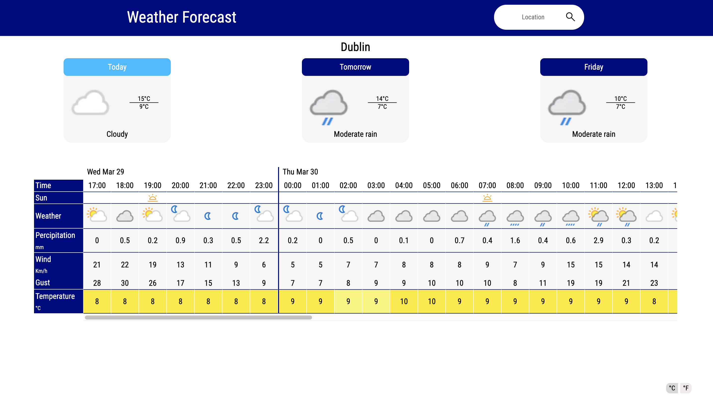

# Weather Forecast App

- Retrieves weather forecast from weatherAPI.com
- Displays forecast in a elegant way using a horizontal scrollbar
- Move the scrollbar to a chosen day by clicking the desired day
- Change between Fahrenheit and Celsius using buttons 
- Stores last input in localStorage

## Link (github pages currently down)

## Screenshot

